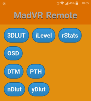

.. contents:: **Contents**

madVR JS remote
===============

   
*madVR JS remote*

Lightweight remote controller for `madVR <http://madvr.com>`_ written in HTML/JS/CSS.

How it works
------------

madVR's API is pretty limited (it doesn't have an interface for modifying different properties). But madVR provides various keyboard shortcuts and allows us to define more of them e.g. for profiles.

So, the idea is that we send actual madVR keyboard shortcuts as a parameter to a media player with web interface and external CGI handler (e.g. MPC-BE/HC) and the player itself will actually trigger these keyboard shortcuts with the help of an external script.

Additionally it can run any batch script only from ``scripts`` directory (for security reasons).

Setup
-----

It's really easy:

- configure MPC-BE/HC accourding to this `screenshot <docs/_static/img/mpc-be_options_player-web-interface.png>`_ (CGI handlers: ``.vbs=c:\Windows\System32\cscript.exe``)
- copy ``webroot`` directory inside MPC-BE/HC main directory
- try it out from a different computer or smartphone (modify the IP/port): ``http://192.168.1.6:13579/madvr.html``

Adding new buttons
--------------------------

It's also really easy:

- add new keyboard shortcut(s) in madVR for predefined properties or your profiles (shouldn't conflict with the built-in keys in the player)
- add them into ``madvr-config.js`` in ``webroot`` directory (custom button ``color`` can also be set), supported types:
    - ``key``: keyboard shortcut
    - ``cmd``: external batch script in ``scripts`` directory

Issues
------

It can only send keystrokes to the foreground application, so MPC-BE/HC will be set to the active window.

Forum
-----

Forum `topic <https://forum.doom9.org/showthread.php?t=175007>`_.

